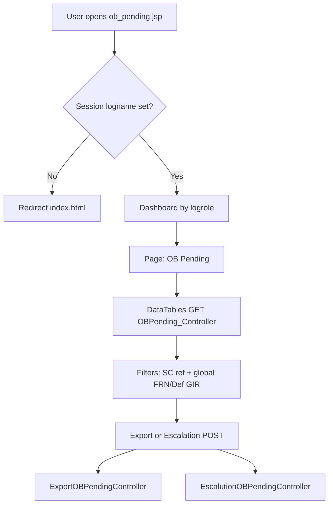

# OB Pending module — legacy behaviour and migration notes

This document describes the legacy **OB Pending** screen (`ob_pending.jsp`), its business rules, servlets/DAOs, and how it relates to **Pending FRN** and the planned migration to the Spring Boot + Next.js stack.

---

## 1. Purpose (what “OB Pending” means)

The list is a **filtered slice of `service_master`** where:

- **`ship_dt_frm_ser_cntr` is null** — “ship from service centre” has **not** been recorded (same **ship** condition as **Pending FRN**).
- **Unit status** (via `dropdownmaster` join on `unit_status = dd_id`) has **`ddvalue` in (`OW`, `LAMC`)** — i.e. **only OW or LAMC** statuses.

So **OB Pending** is the **complement** of **Pending FRN** on unit status **when ship-from-SC is still empty**:

| Queue | Unit status (`ddvalue` via join) | `ship_dt_frm_ser_cntr` |
|--------|----------------------------------|-------------------------|
| **Pending FRN** | **Not** OW and **not** LAMC | `IS NULL` |
| **OB Pending** | **OW** or **LAMC** | `IS NULL` |

**PDays** in the grid: calendar days from **`ser_centre_received_date`** to **today**, same calculation pattern as **Pending FRN** / **Under repair** controllers.

**“OB”** in the UI name is legacy wording (often used alongside product/branch workflows); the **code** does not filter on a separate “OB” column — it is **OW/LAMC + no ship-from-SC**.

---

## 2. Legacy artefacts

| Concern | Artifact | Notes |
|--------|-----------|--------|
| Page | `schillerindiaservices/WebContent/ob_pending.jsp` | Session gate, `admindashboard.jsp` / `VPDashboard.jsp`, DataTables |
| List / AJAX (DataTables) | `OBPending_Controller` → `/OBPending_Controller` | **GET** — JSON `aaData`, `iTotalRecords`, `iTotalDisplayRecords` |
| Export | `ExportOBPendingController` → `/ExportOBPendingController` | **POST** → `OBPendingDao.OBPendingExcel` |
| Escalation | `EscalutionOBPendingController` → `/EscalutionOBPendingController` | **POST** → escalation mail / Excel (see `EscalationOBPendingDao`) |
| Scrap list | `ScrapListOBPendingController` | Mapped in `web.xml`; **commented out** on current `ob_pending.jsp` |
| Other servlet | `OBPendingController` | Different from `OBPending_Controller` — used for non–DataTables flows / `OBPendingDao.OBpending()` |
| Employee view | `emp_OBPending.jsp` + `EmpOBPendingController` | Repair dashboard link; includes **Update** action column |

---

## 3. End-to-end user flow (legacy)



1. **Authentication** — `session.getAttribute("logname")`; else redirect `index.html`.
2. **Shell** — Admin vs VP dashboard include (same pattern as other list JSPs).
3. **Actions** — **Export** (green), **Escalation** (green). Scrap list block is **commented out** in the JSP.
4. **Grid** — DataTables **serverSide: true**, `ajax: "OBPending_Controller"`.

---

## 4. SQL and filters (`OBPending_Controller`)

**Base count / list** (authoritative for the grid):

```sql
FROM service_master sm
INNER JOIN dropdownmaster dm ON sm.unit_status = dm.dd_id
WHERE dm.ddvalue IN ('OW','LAMC')
AND sm.ship_dt_frm_ser_cntr IS NULL
```

**Column search (SC ref)** — same pattern as **Pending FRN** / **Under repair**:

- Parameter `columns[1][search][value]` → `LOWER(sc_ref_no) LIKE LOWER('<prefix>%')` when non-empty (legacy prefix). **Migrated API** uses substring `LIKE '%value%'` for `scRef`.

**Global search** (`search[value]`):

- `def_gir_no LIKE '%term%'` **OR** `frn_no LIKE '%term%'`.

**Sort** — `order[0][column]` indexes into a `cols` array (first entry drives default; includes `sc_ref_no`, etc.).

**Risk (legacy `OBPendingDao.OBpending()` only)** — One variant uses SQL with **ambiguous `AND`/`OR` precedence**; the **controller** uses the **`IN ('OW','LAMC')` + `ship IS NULL`** form above. Migration should follow **`OBPending_Controller`**, not the weaker DAO string.

---

## 5. Grid columns (legacy JSON → UI)

The JSP **thead** lists **15** columns (same labels as **Pending FRN** / **Under repair**):

Id, Entry Date, Sc RNo, Sc Eng, Frn No, Region, Eng, Cust Name, Model, Unit Status, Def Mod / brd name, Def Gir No, Final Remarks, Type of work, PDays.

The servlet resolves names via **`EmployeeDao`**, **`ModelDao`** (e.g. `getModelname`), **`DropdownDao`** for unit status and type of work, and appends **PDays** from **`ser_centre_received_date`**.

**No** per-row Edit/Delete in `ob_pending.jsp` (commented in `fnRowCallback`). The **employee** JSP adds an **Update** link to `OBPendingController`.

---

## 6. PostgreSQL / new stack mapping (for implementation)

- **Table** — `service_master`, `dropdown_master` (entity `DropdownMaster`; join `CAST(TRIM(unit_status) AS bigint) = dm.id` or equivalent; match **Pending FRN** join style).
- **Filter** — `shipDtFrmSerCntr IS NULL` **and** `LOWER(dm.ddValue) IN ('ow','lamc')` (case-insensitive parity with legacy).
- **Repository** — e.g. `findObPending(scRef, keyword, pageable)` mirroring `findPendingFrn` / `findUnderRepair`.
- **API** — e.g. `GET /api/services/ob-pending` with same pagination/query params as other queues; **`/{id:\\d+}`** routing already avoids path clashes.
- **Export** — e.g. `GET /api/services/export/ob-pending`; reuse the same 15-column Excel builder pattern as Pending FRN / Under repair with sheet name **OB Pending** (or **OBPending**).
- **Frontend** — e.g. `/dashboard/ob-pending`; copy structure from **`pending-frn/page.tsx`** (filters, dropdowns, PDays); adjust title and subtitle to describe **OW/LAMC + no ship-from-SC**.
- **Escalations** — Link to existing **`/dashboard/escalations`** or a dedicated OB-specific flow once backend parity exists (`EscalationOBPendingDao` behaviour TBD).

---

## 7. Related navigation (legacy)

- `WebContent/ProductStatus.jsp` — button linking to **`ob_pending.jsp`** (“OB pending”).
- `WebContent/repairDashboard.jsp` — link to **`emp_OBPending.jsp`** for employee role.

---

## 8. Migration checklist (suggested order)

1. [ ] Add `findObPending` JPQL (or native) + tests against sample data (OW/LAMC + ship null).
2. [ ] `ServiceMasterService` + `ServiceMasterController` + `ServiceExportController` endpoints.
3. [ ] Next.js page + `ServiceService` methods + sidebar entry.
4. [ ] Verify **no** overlap bug with **Pending FRN** (mutually exclusive on OW/LAMC vs not).
5. [ ] Optional: **Emp OB Pending** update flow (`emp_OBPending.jsp`) as a follow-up.

---

## 9. Document history

| Date | Note |
|------|------|
| 2026-04-06 | Initial doc from `ob_pending.jsp`, `OBPending_Controller`, `OBPendingDao` |
