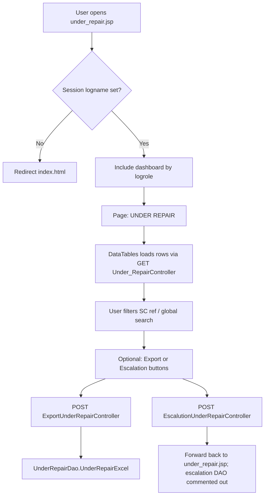

# Under repair module — flow and behaviour

This document describes how the legacy **Under repair** screen works (`under_repair.jsp`), what data it shows, which servlets participate, and how that maps to the modern stack.

---

## 1. Purpose (what “under repair” means here)

The list is **not** “every unit currently being repaired.” It is a **filtered slice of `service_master`** where:

- **`ship_dt_frm_ser_cntr` is not null** — a “ship from service centre” date exists (unit has moved in that workflow step).
- **`repaired_brd_stk_date` is null** — the **repaired board stock date** has **not** been recorded yet.

So the screen tracks records that have **left the SC shipping step in the data** but still **lack** the **repaired board stock date**. Operations use this as a **queue** to complete or monitor those entries. **Pending days (PDays)** in the grid are computed from **`ser_centre_received_date`** to **today** (calendar-day difference), matching the legacy servlet logic.

---

## 2. End-to-end user flow (legacy)

1. **Authentication** — JSP checks `session.getAttribute("logname")`. If missing, redirect to `index.html`.
2. **Shell** — `logrole == "admin"` includes `admindashboard.jsp`; otherwise includes `VPDashboard.jsp`.
3. **Main content** — Heading **UNDER REPAIR**, a **DataTables** grid, and two buttons (**Export**, **Escalation**).
4. **Grid data** — jQuery DataTables **server-side** mode: AJAX **`GET`** to servlet mapped as **`Under_RepairController`** (see URL mapping below). The browser sends DataTables parameters (`start`, `length`, `order`, `search[value]`, column search values).
5. **Export** — Form **`POST`** to **`ExportUnderRepairController`** → `UnderRepairDao.UnderRepairExcel` (Excel download; same business filter as the list, wide column set in the DAO).
6. **Escalation** — Form **`POST`** to **`EscalutionUnderRepairController`**. In the current source, the DAO call that would build/send an escalation Excel is **commented out**; the handler **forwards** back to **`under_repair.jsp`**. So escalation is effectively **not implemented** on that POST path.

---

## 3. Important URLs and classes (legacy)

| Concern | Legacy artifact | Notes |
|--------|------------------|--------|
| Page | `WebContent/under_repair.jsp` | Session gate, dashboard include, DataTables init |
| List / AJAX | `Under_RepairController` → `/Under_RepairController` | **GET**: JSON for DataTables (`aaData`, `iTotalRecords`, …) |
| Export | `ExportUnderRepairController` → `/ExportUnderRepairController` | **POST** → `UnderRepairDao.UnderRepairExcel` |
| Escalation | `EscalutionUnderRepairController` → `/EscalutionUnderRepairController` | **POST** → mostly forward; DAO call commented |
| Similar name | `UnderRepairController` → `/UnderRepairController` | **Different** servlet; used elsewhere (not the JSP AJAX URL) |

The JSP’s DataTables `ajax` URL is **`Under_RepairController`** (with underscore), which maps to **`com.schillerindiaservices.controller.Under_RepairController`**.

---

## 4. Grid columns (legacy JSON order)

The servlet builds each row as an array of **15** cells (after lookups):

| # | Field / meaning |
|---|-----------------|
| 1 | `ser_id` |
| 2 | `entry_date` |
| 3 | `sc_ref_no` |
| 4 | SC engineer — resolved via `EmployeeDao` from `sc_engnr` |
| 5 | `frn_no` |
| 6 | `region` |
| 7 | Engineer — resolved via `EmployeeDao` from `engineer_id` |
| 8 | `cust_name` |
| 9 | Model — resolved via `ModelDao` from `product_model` |
| 10 | Unit status — resolved via `DropdownDao` |
| 11 | `def_mod_brd_name` |
| 12 | `def_gir_no` |
| 13 | `final_remarks` |
| 14 | Type of work — resolved via `DropdownDao` |
| 15 | **PDays** — days from `ser_centre_received_date` to today |

**Sorting** — Default order uses column index **0** mapped to `sc_ref_no`, direction **desc** in `Under_RepairController`.

**Filtering**

- **SC ref** — Legacy: `LOWER(sc_ref_no) LIKE LOWER('<value>%')` (prefix). **Migrated REST** uses **contains** match: `LOWER(sc_ref_no) LIKE LOWER('%' || value || '%')` so any substring (e.g. `396`) matches. The JSP search box `data-column="1"` may not align with the “SC RNo” column index in DataTables (possible legacy UI quirk).
- **Global search** — `search[value]` narrows by **`frn_no`** and **`def_gir_no`** (substring match).

---

## 5. Data layer (legacy)

- **Table**: `service_master`.
- **Core WHERE clause** (list + count in `Under_RepairController`):

  `ship_dt_frm_ser_cntr IS NOT NULL AND repaired_brd_stk_date IS NULL`

- **Resolvers**: Employee names, model name, dropdown labels for unit status and type of work — done in the servlet when building each row.

---

## 6. Modern stack mapping (reference)

The Spring Boot app models the same **queue** with JPA on `ServiceMaster`:

- **Filter**: `shipDtFrmSerCntr != null` and `repairedBrdStkDate == null`.
- **REST**: **`GET /api/services/under-repair`** — pagination, optional **`scRef`** (case-insensitive **substring** on `sc_ref_no`) and **`search`** (FRN + def GIR, aligned with legacy global search). Response includes **`pendingDays`** per row.
- **Export**: **`GET /api/services/export/under-repair`** — `.xlsx` for the same filters (grid-style columns).

**Next.js UI:** **`/dashboard/under-repair`** — list, SC ref + FRN/GIR filters, export, links to view/edit/update/job sheet on the service record, and a shortcut to **Escalations**.

Use this document when testing parity: compare counts, a sample of rows, PDays, and filters between legacy DataTables and the new API.

---

## 7. Open points / quirks

1. **Escalation** — Legacy POST does not run the escalation Excel/mail in the checked-in code; product owners should confirm whether escalation is done manually or via scheduled jobs (`Mailjob*.java` references exist elsewhere).
2. **Export width** — Legacy `UnderRepairExcel` dumps **many** columns from `service_master`; the modern export for under-repair can stay **narrow** (grid-like) unless users require full parity with the old XLS.
3. **Column index vs SC ref search** — Verify in the browser which DataTables column receives the SC ref filter if you reproduce legacy behaviour exactly.

---

*Derived from `under_repair.jsp`, `Under_RepairController.java`, `ExportUnderRepairController.java`, `EscalutionUnderRepairController.java`, and `UnderRepairDao.java` in the legacy project.*
