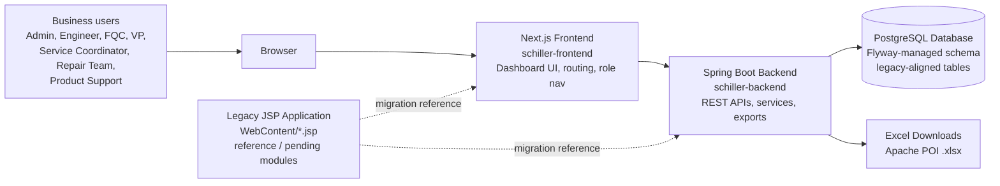
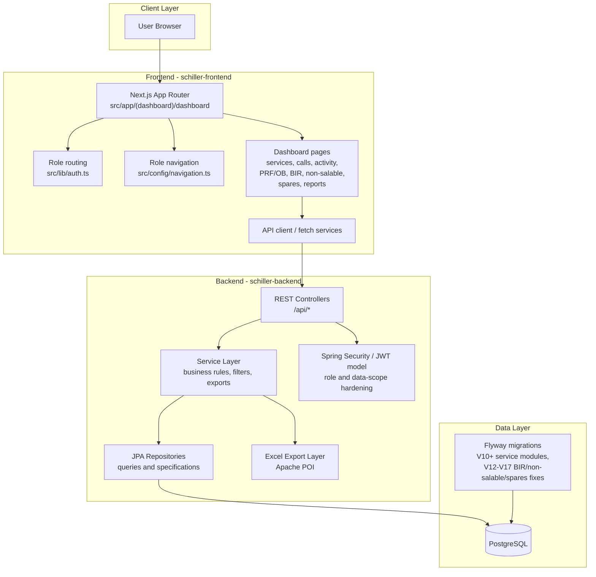
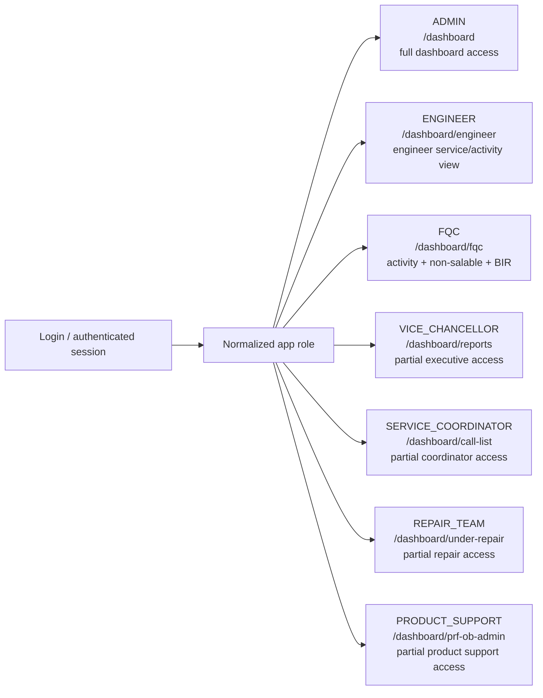
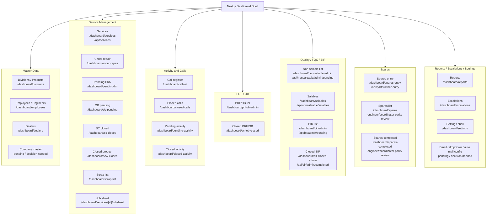
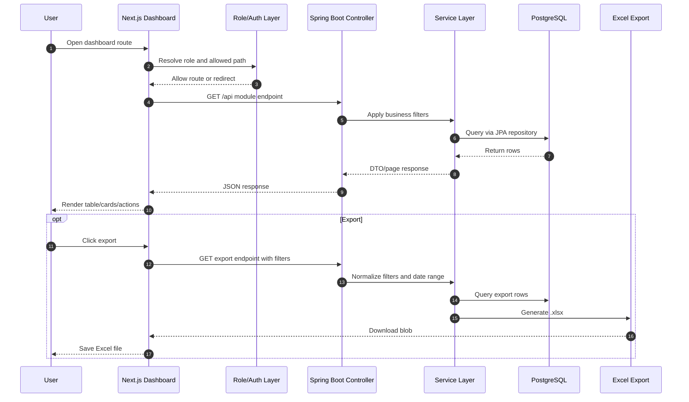
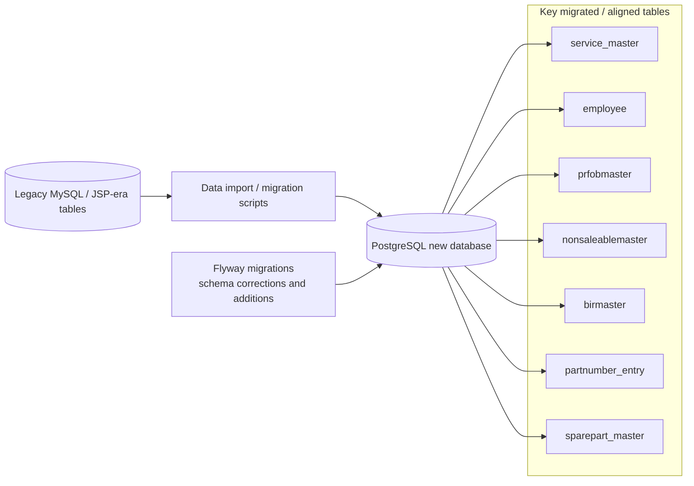

# Schiller India Services - New Migrated Codebase Architecture

**Document type:** High-level architecture diagram  
**Scope:** Current migrated Next.js + Spring Boot codebase and completed/partially migrated modules  
**Related docs:** `MIGRATION_STATUS.md`, `ADMIN_LEGACY_MODULES.md`, `ENGINEER_SERVICE_MODULE_MIGRATION.md`, `AUTHENTICATION_AUTHORIZATION_IMPLEMENTATION_PLAN.md`  
**HTML version:** [ARCHITECTURE_DIAGRAM.html](./ARCHITECTURE_DIAGRAM.html)  
**Last updated:** April 2026

---

## 1. System context

The new application separates the legacy JSP monolith into a **Next.js dashboard frontend**, a **Spring Boot REST API**, and a **PostgreSQL database** managed through Flyway migrations. Legacy JSP files remain the reference for parity, pending modules, and business-rule validation.

---

## 2. Container / layer view

> Note: The architecture target is JWT + role-aware access. The remaining todo list keeps auth hardening as a P0 item so route permissions, endpoint guards, and data scoping are verified before cutover.

---

## 3. Role routing and dashboard access

Legacy `index.jsp` used `logrole` and included one role dashboard JSP. The new codebase normalizes those roles and uses frontend route defaults plus dashboard allow-lists. The largest remaining role-parity gaps are **VP**, **service coordinator**, **repair team**, and **product support**.

---

## 4. Migrated module map

---

## 5. Typical request flow

---

## 6. Data and migration view

The migrated modules preserve legacy table intent where possible. Some migrations include compatibility corrections for pre-existing imported tables, including missing IDs, missing columns, and date column type normalization.

---

## 7. Completed vs pending at architecture level

| Area | Architecture status |
|------|---------------------|
| Dashboard shell | Migrated to Next.js App Router |
| Admin operational lists | Mostly migrated |
| Engineer service list | Migrated with role-aware division scope |
| FQC surface | Migrated at navigation/route level |
| BIR / closed BIR | Migrated list/export/delete; edit parity decision pending |
| Non-salable / salables | Migrated list/export/delete; update parity decision pending |
| Spares entry | Migrated |
| Engineer/coordinator spares list | Existing routes, but role/auth parity review pending |
| VP / coordinator / repair / product support | Partial; role parity work pending |
| Company / dropdown / email / auto mail config | Pending or decision needed |
| Auth hardening | Architecture target defined; implementation/audit remains P0 |
| Cutover readiness | Pending QA, data validation, and production readiness checks |

---

## 8. Recommended next diagram updates

Update this document whenever one of these changes:

1. A pending legacy role receives a dedicated dashboard hub.
2. A legacy-only admin configuration module is migrated or retired.
3. Auth hardening is completed and backend APIs enforce role/data scope.
4. Repair-team and coordinator-specific flows are finalized.
5. The production cutover plan is approved.

